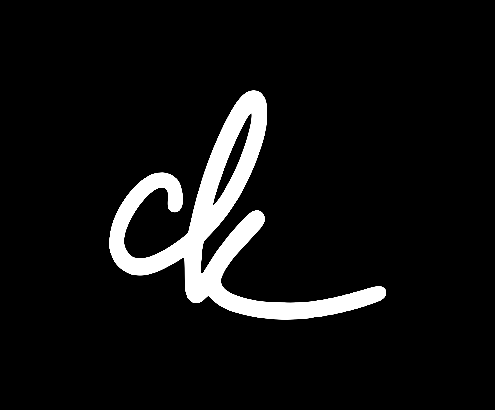

<p align="center">
  
</p>

<h1 align="center">dotfiles</h1>

<p align="center">
  Personal dotfiles for macOS and Linux, managed by <strong>strap</strong> — a Go-based TUI installer.
</p>

---

## Overview

This repo contains configuration files for 20+ tools and a custom CLI (`strap`) that symlinks configs, installs packages, sets up SSH/GPG keys, and configures system preferences — all from an interactive terminal UI.

## Quick Start

```bash
git clone https://github.com/neoighodaro/dotfiles.git ~/Developer/dotfiles
cd ~/Developer/dotfiles/cli
go build -o strap .
./strap install
```

Preview without making changes:

```bash
./strap install --dry-run
```

## What Gets Installed

### Configurations

Configs are symlinked from `configs/` into `$HOME`. Platform-specific variants are handled automatically.

| Category | Tools |
|---|---|
| **Shell** | Zsh (autosuggestions, syntax-highlighting, 200k history), Starship prompt |
| **Terminals** | Ghostty, Wezterm, Zellij |
| **Editors** | VS Code, Cursor, Claude Code |
| **Git** | Delta diffs, SSH signing, 35+ aliases, global hooks |
| **macOS** | AeroSpace (tiling WM), Karabiner, Sketchybar, Hazel |
| **Kubernetes** | K9s with custom skins |
| **Other** | Lazygit, Ansible, SSH, GPG, curl, wget, screen |

### Packages

**Homebrew formulas** — starship, eza, bat, zoxide, fzf, zellij, lazygit, git-delta, bun, ripgrep, fd, jq, gnupg, and more.

**Homebrew casks** — Ghostty, Cursor, Claude Code, Docker, 1Password, Arc, Raycast, AeroSpace, and more.

**Linux** — a curated subset installed via apt.

### Post-Install

- Creates standard directories (`~/Developer`, etc.)
- Links utility scripts to `~/Developer/bin`
- Generates SSH (ed25519) and GPG keys
- Sets macOS system preferences
- Configures default shell to Zsh

## Shell Highlights

```bash
k           # kubectl
lg          # lazygit
cat         # bat (syntax-highlighted cat)
rm          # trash (safe delete on macOS)
please      # sudo last command
reload      # re-source .zshrc
flushdns    # flush macOS DNS cache
```

The full alias list is in [`configs/zsh/aliases.sh`](configs/zsh/aliases.sh).

## Structure

```
configs/        # Tool configurations (symlinked to $HOME)
cli/            # strap — the Go TUI installer
scripts/        # Utility scripts linked to ~/Developer/bin
wallpapers/     # Desktop wallpapers
worktrunk/      # Worktrunk commit generation config
legacy/         # Old shell-based installers (deprecated)
```

## License

[MIT](LICENSE) — Neo Ighodaro
