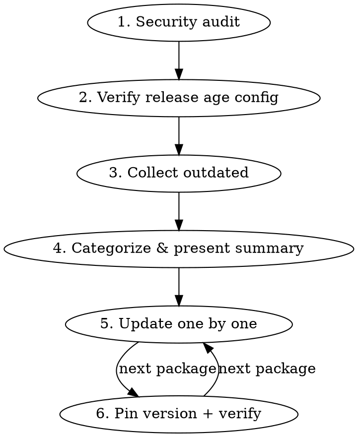

# Package Update (JS/TS)

Safe, methodical package updates with supply chain awareness.

## Overview

Updates packages one at a time, pinning exact versions, with type checks after each. Prioritizes security patches, then groups by risk level. Always verifies supply chain safety before touching anything.

## Workflow



## Phase 1: Security Audit

Research recent npm supply chain attacks (last 6 months). Check:
- Whether any project dependencies were directly compromised
- Recent typosquatting campaigns targeting project packages
- Maintainer/ownership transfers on critical packages
- Known CVEs affecting current versions

Use web search for: `npm supply chain attack [year]`, `npm malicious package [year]`, and check specific high-profile deps (react, vite, tanstack, trpc, etc.).

Present findings with clear SAFE/AFFECTED/INVESTIGATE status per package.

## Phase 2: Minimum Release Age

Verify the package manager enforces a release age quarantine. For bun:

- Check `bunfig.toml` for `minimumReleaseAge` under `[install]`
- Check `package.json` scripts for `--minimum-release-age` flags
- **Recommended:** 604800 (7 days)

If not configured, flag it and offer to add it before proceeding.

**When recommending target versions:** A package version must be older than the configured `minimumReleaseAge` to be installable. Before recommending a version, verify its publish date is beyond the quarantine window (e.g., 7+ days old). If the latest version is too new, recommend the most recent version that clears the threshold. Use `npm view <package> time --json` or the npm registry API (`curl -s "https://registry.npmjs.org/<package>" | jq '.time'`) to check publish dates.

**Security exception:** If the only version that clears the quarantine is missing a known security patch present in a newer (too-new) version, check whether the newer version contains **only** security fixes. If it does, recommend bypassing the release age with `bun install --no-minimum-release-age` for that specific package and document why. If the newer version also contains unrelated changes, assess the risk — a CVE fix justifies the bypass, a routine bugfix does not.

## Phase 3: Collect & Categorize

Run `bun outdated` for root and each workspace. Categorize into:

### Update Priority Order

1. **Security patches** — CVE fixes, known vulnerability patches
2. **Patch updates** — x.y.Z bumps, lowest risk
3. **Minor updates** — x.Y.z bumps within semver range
4. **Ecosystem groups** — packages that must update together (e.g., @tanstack/*, @trpc/*)
5. **Pinned bumps** — packages pinned to exact versions that have newer patches (e.g., react)
6. **Major/breaking** — new major versions, evaluate individually

Present a summary table to the user before starting updates. Include current version, target version, and risk notes.

### Ecosystem Groups

Packages that share version coupling and must be updated together:
- `@tanstack/react-router`, `@tanstack/react-start`, `@tanstack/router-plugin`, `@tanstack/react-router-with-query`, `@tanstack/react-router-devtools`
- `@tanstack/react-query`, `@tanstack/react-query-devtools`
- `@trpc/client`, `@trpc/server`, `@trpc/tanstack-react-query`
- `tailwindcss`, `@tailwindcss/vite`, `@tailwindcss/typography`
- `react`, `react-dom`, `@types/react`, `@types/react-dom`
- `i18next`, `react-i18next`

## Phase 4: Sequential Updates

For each package (or group):

### 4a. Research Breaking Changes
Before updating, check if the version jump includes breaking changes:
- For minor bumps: usually safe, but check changelogs for pre-1.0 packages
- For major bumps: research migration guides, breaking changes, deprecations
- Present findings to user before proceeding

### 4b. Update & Pin

```bash
# Update the package
bun add <package>@<exact-version>

# For dev dependencies
bun add -d <package>@<exact-version>

# For catalog entries (root package.json)
# Edit the catalog version directly to the exact version
```

**Always pin to exact version** — no `^`, no `~`, no range. The lockfile provides reproducibility, but pinning in package.json prevents unintended upgrades when the lockfile is regenerated.

For catalog entries in the root `package.json`, update the catalog version to the exact target.

### 4c. Verify

After each update (or group update):

```bash
bun run check-types    # Type checking
bun run check          # Lint + format
```

If types break, investigate and fix before moving to the next package. If the fix is non-trivial, ask the user whether to proceed or roll back.

### 4d. Report

After each update, briefly state: what was updated, from/to versions, and whether verification passed.

## Major Version Decisions

For major version bumps, present the user with:
1. What breaking changes exist
2. Migration effort estimate (trivial / moderate / significant)
3. Whether to update now, skip, or defer to a separate branch

Never auto-update a major version without user confirmation.

## Common Mistakes

| Mistake | Fix |
|---------|-----|
| Using `^` or `~` when pinning | Always use exact version: `"react": "19.2.6"` not `"react": "^19.2.6"` |
| Updating ecosystem packages individually | Update groups together to avoid version mismatch |
| Skipping type check after update | Always run `bun run check-types` — catch breakage early |
| Updating everything at once | One package/group at a time — isolate breakage |
| Ignoring catalog entries | Monorepos with catalogs need the catalog version updated too |
| Recommending versions newer than minimumReleaseAge | Always verify the target version clears the release age quarantine — `bun install` will reject it otherwise |
