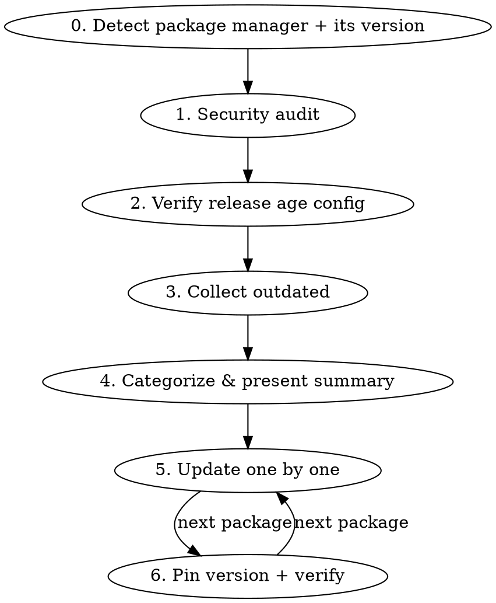

# Package Update (JS/TS)

Safe, methodical package updates with supply chain awareness.

## Overview

Updates packages one at a time, pinning exact versions, with type checks after each. Prioritizes security patches, then groups by risk level. Always verifies supply chain safety before touching anything.

## Workflow

```dot
digraph package_update {
    rankdir=TB;
    "0. Detect package manager + its version" -> "1. Security audit";
    "1. Security audit" -> "2. Verify release age config";
    "2. Verify release age config" -> "3. Collect outdated";
    "3. Collect outdated" -> "4. Categorize & present summary";
    "4. Categorize & present summary" -> "5. Update one by one";
    "5. Update one by one" -> "6. Pin version + verify" -> "5. Update one by one" [label="next package"];
}
```

## Phase 0: Detect the Package Manager

Detect it from the `packageManager` field in the root `package.json`, then from the lockfile (`pnpm-lock.yaml`, `bun.lock`/`bun.lockb`, `package-lock.json`, `yarn.lock`). Use that manager's commands throughout, never another one. Read the scripts in the root `package.json` for the type check and lint commands rather than assuming their names.

| Task | pnpm | bun | npm | yarn (berry) |
|------|------|-----|-----|------|
| List outdated | `pnpm outdated -r` | `bun outdated` (per workspace) | `npm outdated --workspaces` | `yarn upgrade-interactive` |
| Add exact | `pnpm add -E <pkg>@<v>` (`--filter <ws>` in a workspace) | `bun add --exact <pkg>@<v>` | `npm i -E <pkg>@<v>` | `yarn add -E <pkg>@<v>` |
| Add dev exact | add `-D` | add `-d` | add `-D` | add `-D` |
| Catalog | `catalog:` in `pnpm-workspace.yaml` | `catalog` in root `package.json` | n/a | `catalog:` in `.yarnrc.yml` |
| Run a script | `pnpm run <s>` | `bun run <s>` | `npm run <s>` | `yarn <s>` |

### The package manager's own version

The package manager is a dependency too. Compare the pinned version (`packageManager` in `package.json`, plus any `engines`, CI setup action, `.tool-versions`, `mise.toml` or sandbox runtime config that names it) with the latest release that clears the release age. Include it in the summary table as its own row. Update every place that pins it in one step, using the manager's own updater where it has one (`pnpm self-update <v>`, `yarn set version <v>`, `bun upgrade`; npm through the Node version or `npm i -g npm@<v>`), then run a clean install and check the lockfile format did not change unexpectedly. A major bump of the manager is a major update: research it like any other.

## Phase 1: Security Audit

Research recent npm supply chain attacks (last 6 months). Check:
- Whether any project dependencies were directly compromised
- Recent typosquatting campaigns targeting project packages
- Maintainer/ownership transfers on critical packages
- Known CVEs affecting current versions

Use web search for: `npm supply chain attack [year]`, `npm malicious package [year]`, and check specific high-profile deps (react, vite, tanstack, trpc, etc.).

Present findings with clear SAFE/AFFECTED/INVESTIGATE status per package.

## Phase 2: Minimum Release Age

Verify the package manager enforces a release age quarantine:

| Manager | Where | Unit | 7 days |
|---------|-------|------|--------|
| pnpm | `minimumReleaseAge` in `pnpm-workspace.yaml` (or `minimum-release-age` in `.npmrc`) | minutes | 10080 |
| bun | `minimumReleaseAge` under `[install]` in `bunfig.toml`, or `--minimum-release-age` in scripts | seconds | 604800 |
| npm | `min-release-age` in `.npmrc` (npm 11.10+) | days | 7 |
| yarn | `npmMinimalAgeGate` in `.yarnrc.yml` | duration string or minutes | `7d` |

- **Recommended:** 7 days

If not configured, flag it and offer to add it before proceeding.

**When recommending target versions:** A package version must be older than the configured `minimumReleaseAge` to be installable. Before recommending a version, verify its publish date is beyond the quarantine window (e.g., 7+ days old). If the latest version is too new, recommend the most recent version that clears the threshold. Use `npm view <package> time --json` or the npm registry API (`curl -s "https://registry.npmjs.org/<package>" | jq '.time'`) to check publish dates.

**Security exception:** If the only version that clears the quarantine is missing a known security patch present in a newer (too-new) version, check whether the newer version contains **only** security fixes. If it does, recommend bypassing the release age for that specific package (pnpm: add it to `minimumReleaseAgeExclude`; bun: `--no-minimum-release-age`; yarn: `npmPreapprovedPackages`) and document why. If the newer version also contains unrelated changes, assess the risk — a CVE fix justifies the bypass, a routine bugfix does not.

## Phase 3: Collect & Categorize

Run the manager's outdated command for the root and every workspace, and check the package manager's own version (Phase 0). The outdated command may list versions newer than the quarantine allows, so check publish dates before choosing targets. Categorize into:

### Update Priority Order

1. **Security patches** — CVE fixes, known vulnerability patches
2. **Patch updates** — x.y.Z bumps, lowest risk
3. **Minor updates** — x.Y.z bumps within semver range
4. **Ecosystem groups** — packages that must update together (e.g., @tanstack/*, @trpc/*)
5. **Pinned bumps** — packages pinned to exact versions that have newer patches (e.g., react)
6. **Major/breaking** — new major versions, evaluate individually

Present a summary table to the user before starting updates. Include current version, target version, and risk notes.

### Ecosystem Groups

Packages that share version coupling and must be updated together:
- `@tanstack/react-router`, `@tanstack/react-start`, `@tanstack/router-plugin`, `@tanstack/react-router-with-query`, `@tanstack/react-router-devtools`
- `@tanstack/react-query`, `@tanstack/react-query-devtools`
- `@trpc/client`, `@trpc/server`, `@trpc/tanstack-react-query`
- `tailwindcss`, `@tailwindcss/vite`, `@tailwindcss/typography`
- `react`, `react-dom`, `@types/react`, `@types/react-dom`
- `i18next`, `react-i18next`

## Phase 4: Sequential Updates

For each package (or group):

### 4a. Research Breaking Changes
Before updating, check if the version jump includes breaking changes:
- For minor bumps: usually safe, but check changelogs for pre-1.0 packages
- For major bumps: research migration guides, breaking changes, deprecations
- Present findings to user before proceeding

### 4b. Update & Pin

Use the manager's exact add command from Phase 0, in the workspace that declares the dependency. For catalog entries, edit the catalog version directly, then run the manager's install.

**Always pin to exact version** — no `^`, no `~`, no range. The lockfile provides reproducibility, but pinning in package.json prevents unintended upgrades when the lockfile is regenerated.

For catalog entries, update the catalog version to the exact target. Also check `overrides`/`resolutions`, which can pin a version that silently wins over the one you set.

### 4c. Verify

After each update (or group update):

Run the project's type check and lint scripts (found in Phase 0), plus the tests of the workspaces that use the package.

If types break, investigate and fix before moving to the next package. If the fix is non-trivial, ask the user whether to proceed or roll back.

### 4d. Report

After each update, briefly state: what was updated, from/to versions, and whether verification passed.

## Major Version Decisions

For major version bumps, present the user with:
1. What breaking changes exist
2. Migration effort estimate (trivial / moderate / significant)
3. Whether to update now, skip, or defer to a separate branch

Never auto-update a major version without user confirmation.

## Common Mistakes

| Mistake | Fix |
|---------|-----|
| Using `^` or `~` when pinning | Always use exact version: `"react": "19.2.6"` not `"react": "^19.2.6"` |
| Updating ecosystem packages individually | Update groups together to avoid version mismatch |
| Skipping type check after update | Always run the type check script — catch breakage early |
| Updating everything at once | One package/group at a time — isolate breakage |
| Ignoring catalog entries | Monorepos with catalogs need the catalog version updated too |
| Recommending versions newer than minimumReleaseAge | Always verify the target version clears the release age quarantine — the install will reject it otherwise |
| Forgetting the package manager itself | Check `packageManager` and every other place that pins it, every run |
