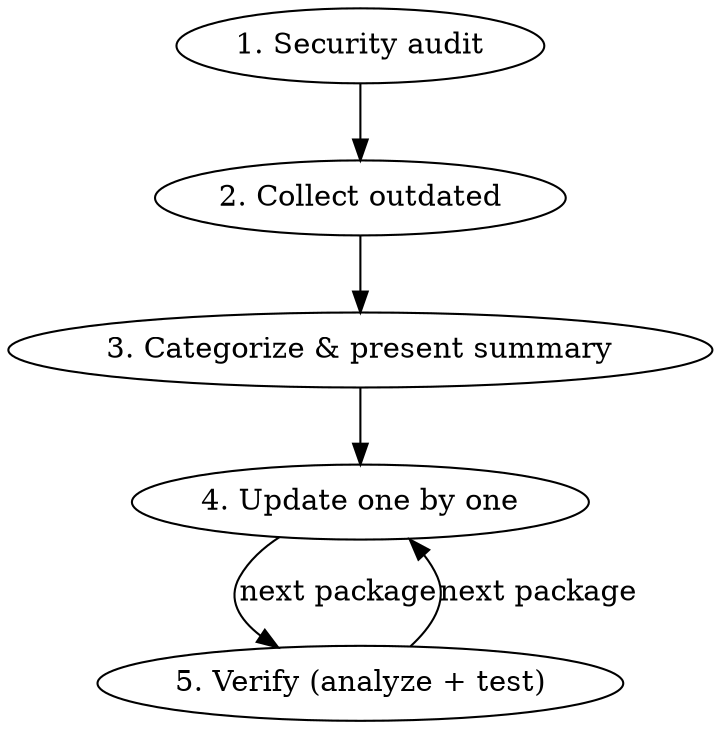

# Package Update (PHP/Composer)

Safe, methodical Composer package updates with supply chain awareness.

## Overview

Updates packages one at a time (or in ecosystem groups), pinning version constraints, with static analysis and tests after each. Prioritizes security patches, then groups by risk level. Always verifies supply chain safety before touching anything.

## Workflow



## Phase 1: Security Audit

Research recent PHP/Composer supply chain incidents (last 6 months). Check:
- Whether any project dependencies have known security advisories
- Recent typosquatting campaigns targeting Packagist packages
- Maintainer/ownership transfers on critical packages
- Known CVEs affecting current versions

Use web search for: `php composer security advisory [year]`, `packagist malicious package [year]`, and check specific high-profile deps (laravel, filament, spatie, etc.).

Run `yulo composer audit` to check for known vulnerabilities in installed packages.

Present findings with clear SAFE/AFFECTED/INVESTIGATE status per package.

## Phase 2: Collect & Categorize

Run `yulo composer outdated --direct --format=json` to list outdated direct dependencies.

### Release Age Gate

**Enforce a minimum 7-day release age** on all package updates. Any package whose latest release is less than 7 days old must be skipped and flagged as "too fresh" in the summary table. This defends against supply chain attacks where compromised versions are live for only hours/days before detection (e.g., the intercom/intercom-php incident of April 2026).

- Use the `release-date` field from `composer outdated --format=json` to calculate age
- Compare against today's date
- Security patches with known CVEs are exempt from the age gate — they should be applied immediately regardless of age
- Flag skipped packages clearly so the user can revisit them later

Categorize into:

### Update Priority Order

1. **Security patches** — CVE fixes, packages flagged by `composer audit`
2. **Patch updates** — x.y.Z bumps, lowest risk
3. **Minor updates** — x.Y.z bumps within semver range
4. **Ecosystem groups** — packages that must update together
5. **Major/breaking** — new major versions, evaluate individually
6. **Pre-release** — 0.x packages where minor bumps may contain breaking changes

Present a summary table to the user before starting updates. Include current version, target version, constraint, and risk notes.

### Ecosystem Groups

Packages that share version coupling and must be updated together:
- `laravel/framework`, `laravel/fortify`, `laravel/horizon`, `laravel/pennant`, `laravel/sanctum`, `laravel/tinker` (Laravel core)
- `laravel/ai` (may depend on specific framework version)
- `filament/filament`, `creativitykills/filament-pennant`, `filament/blueprint` (Filament ecosystem)
- `pestphp/pest`, `pestphp/pest-plugin-laravel` (Pest testing)
- `phpstan/phpstan-deprecation-rules`, `phpstan/phpstan-mockery`, `phpstan/phpstan-webmozart-assert`, `larastan/larastan`, `phpstan/extension-installer` (PHPStan ecosystem)
- `spatie/laravel-medialibrary`, `spatie/laravel-query-builder`, `spatie/laravel-responsecache` (Spatie — only group if they share cross-dependencies)

## Phase 3: Sequential Updates

For each package (or group):

### 3a. Research Breaking Changes

Before updating, check if the version jump includes breaking changes:
- For patch bumps: usually safe
- For minor bumps: check changelogs, especially for 0.x packages where minor = breaking
- For major bumps: research migration guides, breaking changes, deprecations
- Use `search-docs` to check for version-specific documentation when available
- Present findings to user before proceeding

### 3b. Update

**Always use `--no-scripts`** on update commands to prevent post-install scripts from running automatically. This is a supply chain defense — scripts run with full shell access and could execute malicious code from a compromised package. Run scripts manually after verifying the update.

```bash
# Always pin to the exact target version using composer require
yulo composer require <package>:<exact-version> --no-interaction --no-scripts

# For dev dependencies
yulo composer require --dev <package>:<exact-version> --no-interaction --no-scripts

# After verifying the update looks good, regenerate autoload and run scripts
yulo composer dump-autoload
```

**Always pin exact versions.** Never use `composer update <package>` — always use `composer require <package>:<version>` with the exact version (no `^`, no `~`, no ranges). This locks the dependency to a known-good version, makes updates explicit in the diff, and prevents unintended drift on subsequent `composer update` calls.

Examples: `composer require laravel/sanctum:4.3.2`, `composer require filament/filament:5.6.3`

**Pin ALL dependencies, not just updated ones.** As part of Phase 2, before starting updates, scan `composer.json` for any dependency using range constraints (`^`, `~`, `*`, `>=`). Pin every one to its currently installed exact version. This ensures no package drifts on a future `composer update` and makes the full dependency set reproducible. Use `composer show --direct --format=json` to get installed versions, then `composer require <package>:<exact-installed-version>` (or `--dev` for dev deps) for each unpinned entry.

**Watch for require/require-dev migration.** When pinning, always check whether a package is in `require` or `require-dev` and use the matching flag. Composer will silently move a dev package to `require` (or vice versa) if you use the wrong flag.

### 3c. Verify

After each update (or group update):

```bash
yulo analyze            # PHPStan static analysis
yulo test --compact     # Run test suite
```

If analysis or tests fail, investigate and fix before moving to the next package. If the fix is non-trivial, ask the user whether to proceed or roll back with `yulo composer require <package>:<previous-constraint>`.

### 3d. Report

After each update, briefly state: what was updated, from/to versions, and whether verification passed.

## Major Version Decisions

For major version bumps, present the user with:
1. What breaking changes exist
2. Migration effort estimate (trivial / moderate / significant)
3. Whether to update now, skip, or defer to a separate branch

Never auto-update a major version without user confirmation.

## Pre-release Packages (0.x)

This project uses several 0.x packages (`laravel/ai`, `brick/money`, `prism-php/prism`, `staabm/phpstan-todo-by`). For these:
- Treat minor bumps (0.Y.z) as potentially breaking
- Always check changelogs before updating
- Present as higher risk in the summary table

## Common Mistakes

| Mistake | Fix |
|---------|-----|
| Updating ecosystem packages individually | Update groups together to avoid version mismatch |
| Skipping analysis after update | Always run `yulo analyze` — catch type issues early |
| Skipping tests after update | Always run `yulo test --compact` — catch runtime breakage |
| Updating everything at once | One package/group at a time — isolate breakage |
| Treating 0.x minor bumps as safe | 0.x packages can break on minor bumps — always check changelogs |
| Running `composer update` without package name | Always specify packages — blanket update defeats the purpose |
| Forgetting `--no-interaction` flag | Artisan/Composer commands must run non-interactively |
| Running update without `--no-scripts` | Always use `--no-scripts` — post-install scripts can execute arbitrary code from compromised packages |
| Updating packages released < 7 days ago | Enforce the 7-day release age gate — supply chain compromises are often detected within days |
| Using `composer update` instead of `composer require` | Always pin with `composer require <pkg>:^<version>` — makes the update explicit in composer.json |
