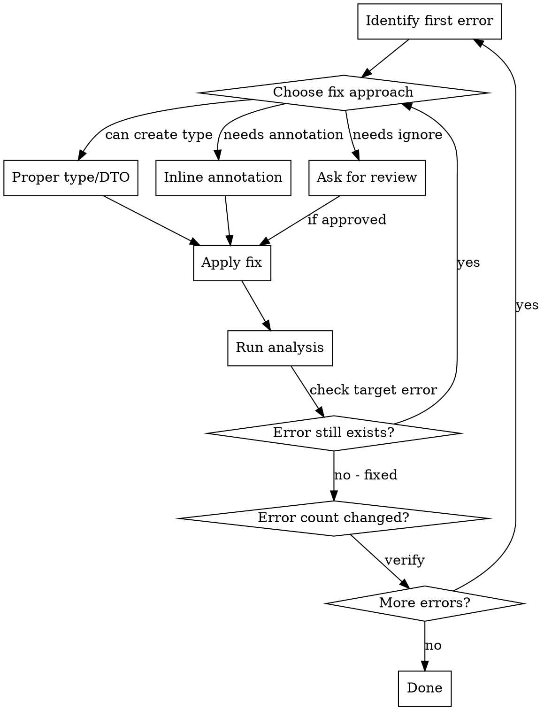

# Solving PHPStan Errors

## Overview

**Core principle:** Fix PHPStan errors one at a time with verification between each fix. Prefer proper types over inline annotations.

## When to Use

Use when:
- Running static analysis shows PHPStan errors
- Dealing with template type resolution issues
- Fixing nullable object access warnings
- Working with Laravel collections and type inference

## Quick Reference

| Error Type               | First Choice              | Last Resort             |
|--------------------------|---------------------------|-------------------------|
| Template type resolution | Extract to typed variable | `@var` inline           |
| Nullable access          | Null check or `?->`       | `@phpstan-ignore`       |
| Collection types         | Type before `collect()`   | Generic collection type |
| Complex arrays           | Data object/DTO           | Array shape annotation  |

## Implementation

### Step 1: Analyze Scope

```bash
# Check error count using phpstan (the command might be specific to the project, if none, use default phpstan command)
# If >20 errors, create execution plan
```

**Decision point:** >20 errors = create written plan with TodoWrite

### Step 2: Fix One Error at a Time

**CRITICAL:** Never fix multiple errors in parallel. One fix may resolve others.



### Step 3: Choose Fix Strategy

**Preference order (best to worst):**

1. **Create proper type (Data Object/DTO)**
   ```php
   // ✅ Best: Proper type
   final readonly class UserData
   {
       public function __construct(
           public string $name,
           public string $email,
       ) {}
   }

   return new UserData($name, $email);
   ```

2. **Extract and type variable**
   ```php
   // ✅ Good: Type before problematic operation
   /** @var array<int, array{name: string, email: string}> $users */
   $users = $response['users'];
   $collection = collect($users);
   ```

3. **Inline type annotation**
   ```php
   // ⚠️ OK: When extraction doesn't help
   /** @var \Illuminate\Support\Collection<int, User> $users */
   $users = collect($data)->filter(...);
   ```

4. **PHPStan ignore comments**
   ```php
   // ❌ Last resort: Ask for review first
   /** @phpstan-ignore-next-line */
   return $collection[$index];
   ```

### Common Error Patterns

#### Template Type Resolution in `collect()`

**Problem:** PHPStan can't infer TKey/TValue from array

```php
// ❌ Causes error
$collection = collect($array)->map(...);
```

**Solution:** Type the array first

```php
// ✅ Fix
/** @var array<int, string> $items */
$items = $array;
$collection = collect($items)->map(...);
```

#### Nullable Collection Access

**Problem:** Accessing collection item that might not exist

```php
// ❌ Error: might be null
$answers = $answersByQuiz[$index]->map(...);
```

**Solution:** Null check with explicit error

```php
// ✅ Fix
$answers = $answersByQuiz->get($index);
if ($answers === null) {
    throw new RuntimeException("Missing answers at index {$index}");
}
$mapped = $answers->map(...);
```

#### Unnecessary Null Coalescing

**Problem:** Using `??` when type guarantees non-null

```php
// ❌ Error: always exists
/** @var array<int, array{is_correct: bool}> $answers */
$correct = collect($answers)->filter(fn($a) => $a['is_correct'] ?? false);
```

**Solution:** Remove `??` since type guarantees existence

```php
// ✅ Fix
$correct = collect($answers)->filter(fn($a) => $a['is_correct']);
```

## Planning for Large Error Sets

**When errors >30, create plan with TodoWrite:**

```markdown
1. Group errors by type (template resolution, nullable access, etc.)
2. Estimate: ~2-5 minutes per error
3. Create todos for each group
4. Fix group by group, not file by file
```

## Red Flags - Ask for Review First

Stop and ask before using:
- `@phpstan-ignore-next-line`
- `@phpstan-ignore-line`
- Disabling specific rules in phpstan.neon
- Suppressing errors with `@` operator

These usually indicate architectural issues worth discussing.

## Verification Protocol

After EACH fix:
1. Run the phpstan command to check for errors (it might be specific to the project which command to run)
2. Check if target error disappeared
3. Check if error count changed (one fix might resolve multiple)
4. Document unexpected changes

**Never:**
- Fix multiple files without running analysis
- Assume similar errors need similar fixes
- Skip verification "because it's obvious"

## Common Mistakes

| Mistake                          | Why Bad                    | Fix                           |
|----------------------------------|----------------------------|-------------------------------|
| Fix all errors before testing    | One fix might resolve many | Test after each fix           |
| Use `@phpstan-ignore` first      | Hides real issues          | Try proper types first        |
| Generic `@var mixed` annotations | Defeats type safety        | Be specific with array shapes |
| Skip error count verification    | Miss cascading fixes       | Always check total count      |
| Inline all type hints            | Hard to read, maintain     | Create DTOs for complex types |

## Real-World Impact

**Before:** 36 PHPStan errors blocking deployment

**After:** Systematic fix-and-verify process:
- Fixed 36 → 12 errors in first pass (nullable access fixes resolved related errors)
- Fixed 12 → 0 errors in second pass (template type annotations)
- Total time: ~30 minutes
- Zero false solutions, zero regressions
